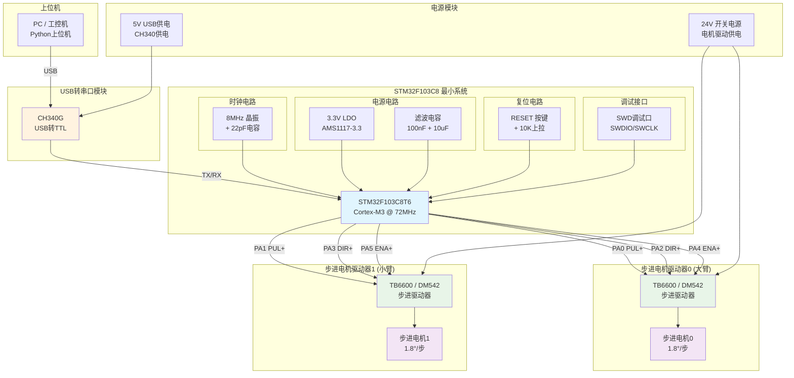
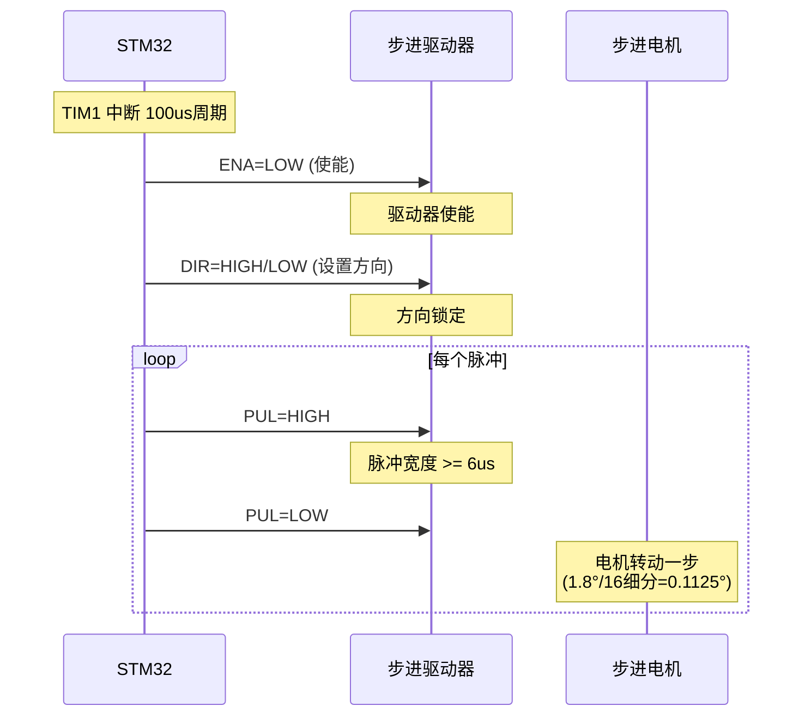

# SCARA 机械臂电气原理图

## 系统总体连接图



## STM32F103C8 引脚分配图

```mermaid
graph LR
    subgraph "STM32F103C8T6"
        PA0[PA0<br/>TIM2_CH1<br/>PUL0]
        PA1[PA1<br/>TIM2_CH2<br/>PUL1]
        PA2[PA2<br/>USART2_TX<br/>DIR0]
        PA3[PA3<br/>USART2_RX<br/>DIR1]
        PA4[PA4<br/>SPI1_NSS<br/>ENA0]
        PA5[PA5<br/>SPI1_SCK<br/>ENA1]
        PA9[PA9<br/>USART1_TX<br/>UART_TX]
        PA10[PA10<br/>USART1_RX<br/>UART_RX]
        PA13[PA13<br/>SWDIO]
        PA14[PA14<br/>SWCLK]
        PB0[BOOT0<br/>接地]
        NRST[NRST<br/>复位]
        VDD[VDD<br/>3.3V]
        VSS[VSS<br/>GND]
        OSC_IN[OSC_IN<br/>8MHz晶振]
        OSC_OUT[OSC_OUT<br/>8MHz晶振]
    end

    style PA0 fill:#ffcdd2
    style PA1 fill:#ffcdd2
    style PA2 fill:#ffcdd2
    style PA3 fill:#ffcdd2
    style PA4 fill:#ffcdd2
    style PA5 fill:#ffcdd2
    style PA9 fill:#e1f5fe
    style PA10 fill:#e1f5fe
    style PA13 fill:#e8f5e8
    style PA14 fill:#e8f5e8
```



## 详细电气连接表

### 1. 电源电路

| 信号 | 来源 | 目标 | 说明 |
|------|------|------|------|
| 5V | USB | CH340G VCC | USB供电 |
| 3.3V | AMS1117 | STM32 VDD | LDO稳压输出 |
| 24V | 开关电源 | 步进驱动器 VCC | 电机驱动电源 |
| GND | 所有模块 | 公共地 | 共地连接 |

### 2. 串口通信接口 (USART1)

| STM32引脚 | 连接目标 | 信号方向 | 功能 |
|-----------|----------|----------|------|
| PA9 (USART1_TX) | CH340 RXD | 输出 | 发送数据到上位机 |
| PA10 (USART1_RX) | CH340 TXD | 输入 | 接收上位机数据 |

**通信参数**: 921600 bps, 8N1, 无流控

### 3. 步进电机驱动器0 (大臂关节)

| STM32引脚 | 驱动器信号 | 有效电平 | 功能说明 |
|-----------|------------|----------|----------|
| PA0 | PUL+ | 上升沿 | 脉冲信号，上升沿触发一步 |
| PA2 | DIR+ | 高/低 | 方向控制：Low=正向, High=反向 |
| PA4 | ENA+ | 低有效 | 使能控制：Low=使能, High=关闭 |
| GND | PUL-/DIR-/ENA- | - | 信号地 |

**驱动器设置**: 细分 3200脉冲/转 (16细分)

### 4. 步进电机驱动器1 (小臂关节)

| STM32引脚 | 驱动器信号 | 有效电平 | 功能说明 |
|-----------|------------|----------|----------|
| PA1 | PUL+ | 上升沿 | 脉冲信号，上升沿触发一步 |
| PA3 | DIR+ | 高/低 | 方向控制：Low=正向, High=反向 |
| PA5 | ENA+ | 低有效 | 使能控制：Low=使能, High=关闭 |
| GND | PUL-/DIR-/ENA- | - | 信号地 |

**驱动器设置**: 细分 3200脉冲/转 (16细分)

### 5. 时钟电路

| 引脚 | 连接 | 参数 |
|------|------|------|
| OSC_IN (PD0) | 8MHz晶振 Y1 | 负载电容 22pF |
| OSC_OUT (PD1) | 8MHz晶振 Y1 | 负载电容 22pF |

**PLL配置**: HSE × 9 = 72MHz 系统时钟

### 6. 调试接口 (SWD)

| STM32引脚 | 调试器信号 | 功能 |
|-----------|------------|------|
| PA13 | SWDIO | 数据线 |
| PA14 | SWCLK | 时钟线 |
| NRST | RESET | 复位信号 |
| VDD | VCC | 3.3V供电 |
| GND | GND | 地线 |

### 7. 复位电路

| 信号 | 连接 | 说明 |
|------|------|------|
| NRST | 10KΩ上拉到VCC + 100nF到GND | RC复位电路 |
| NRST | 复位按键到GND | 手动复位 |

### 8. BOOT配置

| 引脚 | 连接 | 说明 |
|------|------|------|
| BOOT0 | 10KΩ下拉到GND | 从Flash启动 |
| BOOT1 (PB2) | 悬空或下拉 | - |

## 信号时序图



## 电气参数汇总

| 参数 | 值 | 说明 |
|------|-----|------|
| MCU供电电压 | 3.3V | AMS1117-3.3 LDO |
| 电机驱动电压 | 24V DC | 开关电源 |
| 串口波特率 | 921600 bps | USART1 |
| 脉冲宽度 | ≥6μs | 高电平持续时间 |
| 控制周期 | 100μs | TIM1中断周期 |
| 最大脉冲频率 | 10kHz | 受控制周期限制 |
| 电机细分 | 3200脉冲/转 | 16细分 (1.8°电机) |
| GPIO输出速度 | PA0/PA1: 50MHz | 脉冲引脚高速 |
| GPIO输出速度 | PA2-PA5: 2MHz | 方向/使能引脚低速 |

## 典型应用电路图

```
                    ┌─────────────────────────────────────────────────────┐
                    │                    STM32F103C8T6                     │
                    │                                                     │
    USB转TTL模块    │    ┌─────────┐                                      │
   ┌─────────┐      │    │  8MHz   │                                      │
   │  CH340G │      │    │  晶振   │                                      │
   │         │      │    └────┬────┘                                      │
   │  TXD ───┼──────┼────────┼───── PA10 (USART1_RX)                     │
   │  RXD ───┼──────┼────────┼───── PA9  (USART1_TX)                     │
   │  VCC ───┼──────┼───[3.3V LDO]─── VDD                               │
   │  GND ───┼──────┼────────┼───── GND                                  │
   └─────────┘      │         │                                          │
        │           │    ┌────┴────┐                                      │
       USB          │    │ 100nF + │                                      │
        │           │    │ 10uF    │                                      │
   ┌────┴────┐      │    └────┬────┘                                      │
   │   PC    │      │         │                                          │
   └─────────┘      │         │                                          │
                    │         │                                          │
                    │    ┌────┴────────────────────────────────────────┐  │
                    │    │            步进电机驱动器 0                   │  │
                    │    │            (TB6600/DM542)                    │  │
                    │    │                                             │  │
                    │    │  PA0 ──── PUL+    ┌─────────┐              │  │
                    │    │  PA2 ──── DIR+    │ 步进电机 │              │  │
                    │    │  PA4 ──── ENA+    │   0     │              │  │
                    │    │  GND ──── PUL-    │ (大臂)  │              │  │
                    │    │  GND ──── DIR-    └─────────┘              │  │
                    │    │  GND ──── ENA-                             │  │
                    │    │                                             │  │
                    │    └─────────────────────────────────────────────┘  │
                    │                                                     │
                    │    ┌─────────────────────────────────────────────┐  │
                    │    │            步进电机驱动器 1                   │  │
                    │    │            (TB6600/DM542)                    │  │
                    │    │                                             │  │
                    │    │  PA1 ──── PUL+    ┌─────────┐              │  │
                    │    │  PA3 ──── DIR+    │ 步进电机 │              │  │
                    │    │  PA5 ──── ENA+    │   1     │              │  │
                    │    │  GND ──── PUL-    │ (小臂)  │              │  │
                    │    │  GND ──── DIR-    └─────────┘              │  │
                    │    │  GND ──── ENA-                             │  │
                    │    │                                             │  │
                    │    └─────────────────────────────────────────────┘  │
                    │                                                     │
                    │    ┌─────────────────────────────────────────────┐  │
                    │    │              SWD调试接口                     │  │
                    │    │                                             │  │
                    │    │  PA13 ─── SWDIO                            │  │
                    │    │  PA14 ─── SWCLK                            │  │
                    │    │  NRST ─── RESET                            │  │
                    │    │  VDD  ─── VCC (3.3V)                       │  │
                    │    │  GND  ─── GND                              │  │
                    │    │                                             │  │
                    │    └─────────────────────────────────────────────┘  │
                    │                                                     │
                    └─────────────────────────────────────────────────────┘

电源连接：
┌─────────────┐        ┌─────────────┐        ┌─────────────┐
│  24V开关电源 │        │  USB 5V     │        │ 3.3V LDO    │
│             │        │             │        │ (AMS1117)   │
│  + ─────────┼───[保险丝]─── 驱动器VCC │        │             │
│  - ─────────┼────┼────────── 驱动器GND │   IN ─┼─── 5V USB   │
└─────────────┘    │                 │   OUT──┼─── 3.3V MCU  │
                   │                 │   GND──┼─── 公共地    │
                   └─────────────────┘        └─────────────┘
```

## 注意事项

1. **共地连接**: 所有模块的GND必须连接在一起，确保信号参考电平一致
2. **电源隔离**: 24V电机电源与3.3V逻辑电源建议使用独立供电，通过光耦或隔离芯片隔离信号
3. **信号线长度**: PUL/DIR/ENA信号线建议使用双绞线，长度不超过2米
4. **EMI防护**: 电机驱动器输入端建议并联100nF电容滤波
5. **电流限制**: 步进电机驱动器需根据电机额定电流设置驱动电流
6. **散热**: 驱动器和LDO需考虑散热，必要时加装散热片
