# SCARA 机械臂下位机控制系统设计目标、功能模块与流程分析

## 摘要

本文档系统阐述 SCARA 机械臂下位机控制系统的设计目标、功能模块划分、各模块实现方式以及模块内部与模块间的处理流程。系统基于 STM32F103 微控制器，采用分层架构实现通信协议解析、轨迹规划、运动队列管理和步进电机控制。通过 DMA 双缓冲接收机制保障通信效率，通过单生产者单消费者无锁队列实现主循环与定时器中断间的数据传递，通过三次多项式插值实现关节空间平滑轨迹生成。文档以流程图形式呈现各功能模块的内部逻辑和模块间的协作关系。

**关键词：** SCARA 机械臂；STM32F103；控制系统设计；功能模块；流程图

---

## 1. 设计目标

### 1.1 总体目标

本系统作为 SCARA 机械臂的下位机控制器，其总体设计目标是接收上位机发送的关节空间运动指令，在微控制器端完成轨迹插值与步进电机脉冲输出，实现双关节的协调运动控制。系统定位为"关节空间下位机执行器"，而非完整的运动学求解器。

### 1.2 具体设计指标

| 设计指标 | 目标值 | 说明 |
|---|---|---|
| 控制轴数 | 2 轴 | SCARA 机械臂大臂和小臂关节 |
| 通信波特率 | 921600 bps | 高速串口通信 |
| 控制周期 | 100 μs (10 kHz) | TIM1 定时器中断周期 |
| 最大单轴步频 | 10 kHz | 受控制周期约束 |
| 每转脉冲数 | 3200 | 步进电机细分设置 |
| 运动段队列深度 | 127 段 | SPSC 队列有效容量 |
| UART 接收缓冲 | 1023 字节 | 环形缓冲区容量 |
| 运动段最大时间 | 理论无限制 | 受浮点精度约束 |

### 1.3 设计约束

1. **硬件约束**：MCU 无 FPU，浮点运算通过软件仿真实现；
2. **实时性约束**：脉冲生成必须在定时器中断中完成，确保时序精度；
3. **通信约束**：协议采用二进制固定帧格式，无 CRC 校验；
4. **控制约束**：系统为开环步进控制，位置反馈来自内部步数计数而非外部传感器。

---

## 2. 系统架构

### 2.1 整体架构概览

下位机系统采用分层架构设计，自下而上分为硬件抽象层、设备驱动层、服务支撑层和应用逻辑层。各层之间通过明确的接口进行交互，实现关注点分离和模块解耦。

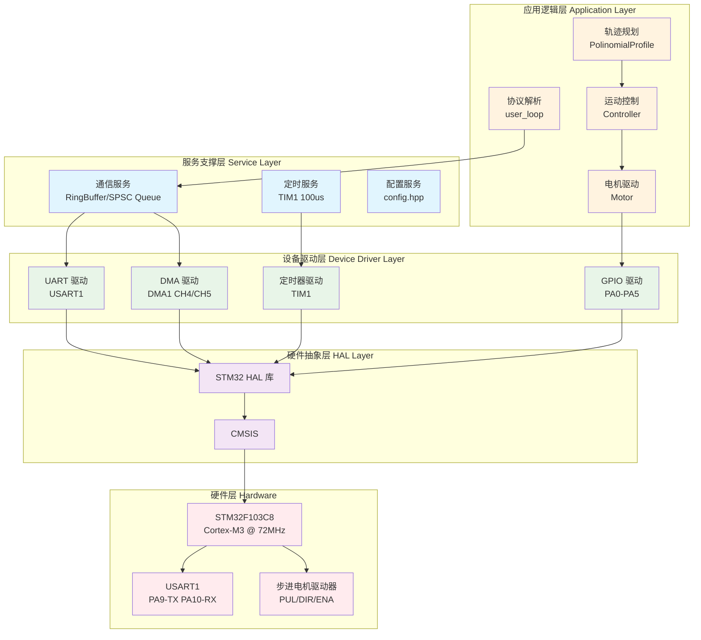

### 2.2 各层职责说明

| 层次 | 职责 | 主要组件 |
|---|---|---|
| **硬件层** | 物理设备，包括 MCU、外设和执行机构 | STM32F103C8、USART1、步进电机驱动器 |
| **硬件抽象层** | 提供统一的硬件访问接口，屏蔽底层差异 | STM32 HAL 库、CMSIS |
| **设备驱动层** | 封装具体外设的操作，提供设备级服务 | UART 驱动、DMA 驱动、定时器驱动、GPIO 驱动 |
| **服务支撑层** | 提供通用服务，如数据缓冲、定时调度、配置管理 | RingBuffer、SPSC Queue、TIM1 调度、config |
| **应用逻辑层** | 实现业务逻辑，包括协议处理、轨迹规划和运动控制 | user_loop、PolinomialProfile、Controller、Motor |

### 2.3 模块依赖关系架构图

下图展示各功能模块之间的依赖关系和数据流向：

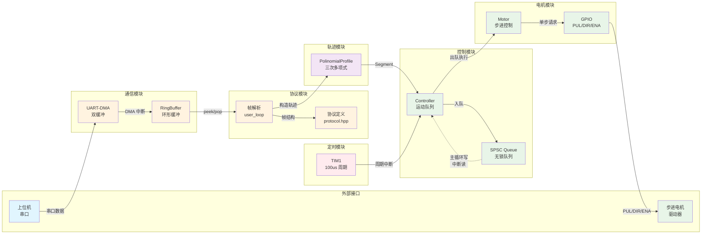

### 2.4 执行上下文架构图

系统存在三个并发执行的上下文，各自承担不同职责：

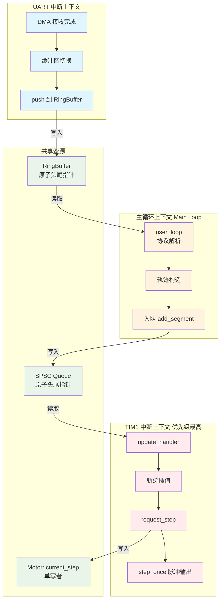

### 2.5 中断优先级与实时性保障

| 中断源 | 优先级 | 抢占/子优先级 | 周期/触发条件 | 实时性要求 |
|---|---|---|---|---|
| TIM1 更新 | 最高 | 0/0 | 100 μs | 硬实时：脉冲时序必须精确 |
| USART1 IDLE | 中 | 1/0 | 数据帧到达 | 软实时：允许少量延迟 |
| DMA1 CH4/CH5 | 中 | 0/0 | 传输完成 | 软实时：配合 UART |
| SysTick | 最低 | 默认 | 1 ms | 非实时：仅用于 HAL 时基 |

---

## 3. 功能模块划分

系统功能模块可划分为以下六个主要部分：

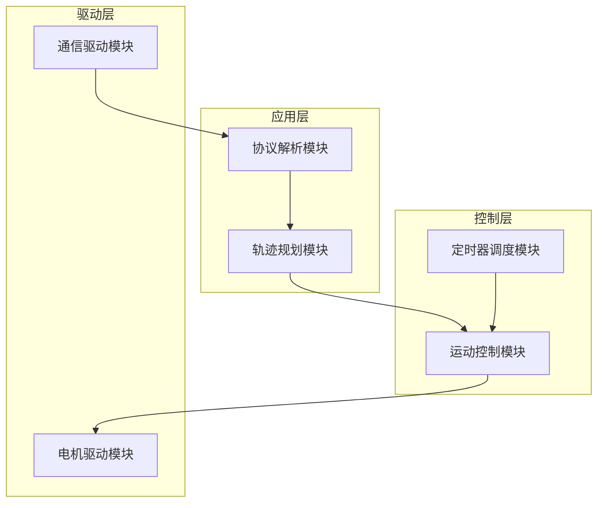

### 2.1 模块职责概述

| 模块名称 | 主要文件 | 职责描述 |
|---|---|---|
| 通信驱动模块 | `usart.c`、`dma.c`、`user_main.cpp` | UART-DMA 双缓冲接收、环形缓冲区管理、DMA 发送 |
| 协议解析模块 | `protocol.hpp`、`user_main.cpp` | 帧同步、命令分派、数据合法性检查、响应生成 |
| 轨迹规划模块 | `polinomial_profile.hpp` | 三次多项式系数计算、目标步数插值、速度衔接 |
| 运动控制模块 | `motor.hpp` | 运动段队列管理、周期调度、电机脉冲控制 |
| 定时器调度模块 | `tim.c`、`stm32f1xx_it.c` | TIM1 100 μs 周期中断、回调注册与转发 |
| 电机驱动模块 | `motor.hpp`、`gpio.c` | GPIO 电平控制、角度步数转换、限位检查 |

---

## 3. 功能模块详细设计与实现

### 3.1 通信驱动模块

#### 3.1.1 设计目标

实现高效可靠的串口数据收发，满足 921600 bps 波特率下的实时通信需求，避免主循环阻塞在数据等待上。

#### 3.1.2 实现方式

**接收路径**：采用 DMA + IDLE 中断 + 双缓冲 + 环形缓冲四层机制。

- 硬件层：USART1 配置为 921600-8N1，DMA1_Channel5 负责接收（`Core/Src/usart.c:43-51`）；
- DMA 层：使用 `HAL_UARTEx_ReceiveToIdle_DMA()` 启动接收，IDLE 中断触发回调（`user/user_main.cpp:32-36`）；
- 缓冲层：双缓冲 `uart_rx_raw_buffer[2][512]` 交替接收，避免数据覆盖（`user/user_main.cpp:21-22`）；
- 应用层：接收数据推入 `RingBuffer<1023>`，由主循环消费（`user/user_main.cpp:38-46`）。

**发送路径**：采用 DMA + 忙标志机制。

- 静态缓冲区 `uart_tx_raw_buffer[64]` 暂存待发数据；
- `uart_tx_busy` 原子标志防止并发发送；
- TX complete 回调清除忙标志（`user/user_main.cpp:48-63`）。

#### 3.1.3 接收流程图

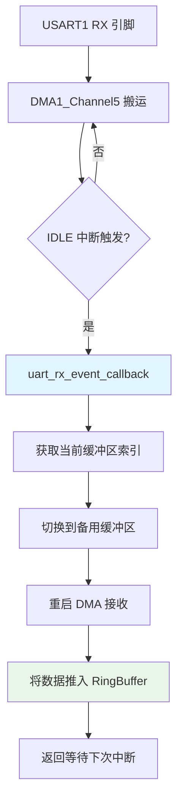

#### 3.1.4 发送流程图

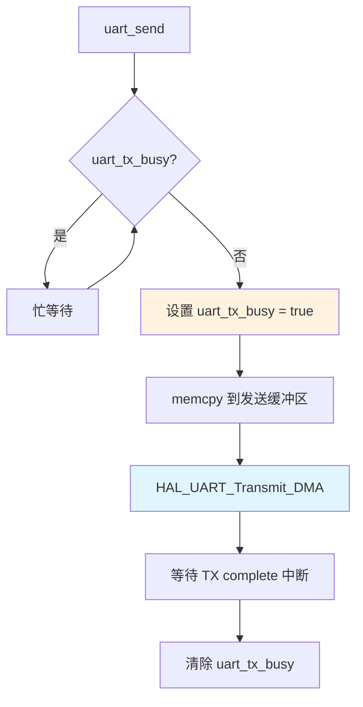

### 3.2 协议解析模块

#### 3.2.1 设计目标

实现二进制固定帧协议的同步、解析和命令分派，支持 Motion、EmergencyStop、QueryStatus 三种命令，并返回 ACK/NACK/StatusResponse 响应。

#### 3.2.2 实现方式

协议定义于 `user/protocol.hpp`，采用 `#pragma pack(push, 1)` 保证 1 字节对齐。帧头固定为 `0xAA 0x55`，Header 占 4 字节（含 padding）。命令码采用 `uint8_t` 枚举，帧长度根据命令类型固定。

解析逻辑实现于 `user_loop()`，采用逐字节窥视的帧同步策略：先检查首字节是否为 `0xAA`，再读取完整 Header 验证帧头有效性，最后根据命令码分派处理（`user/user_main.cpp:91-228`）。

#### 3.2.3 帧同步流程图

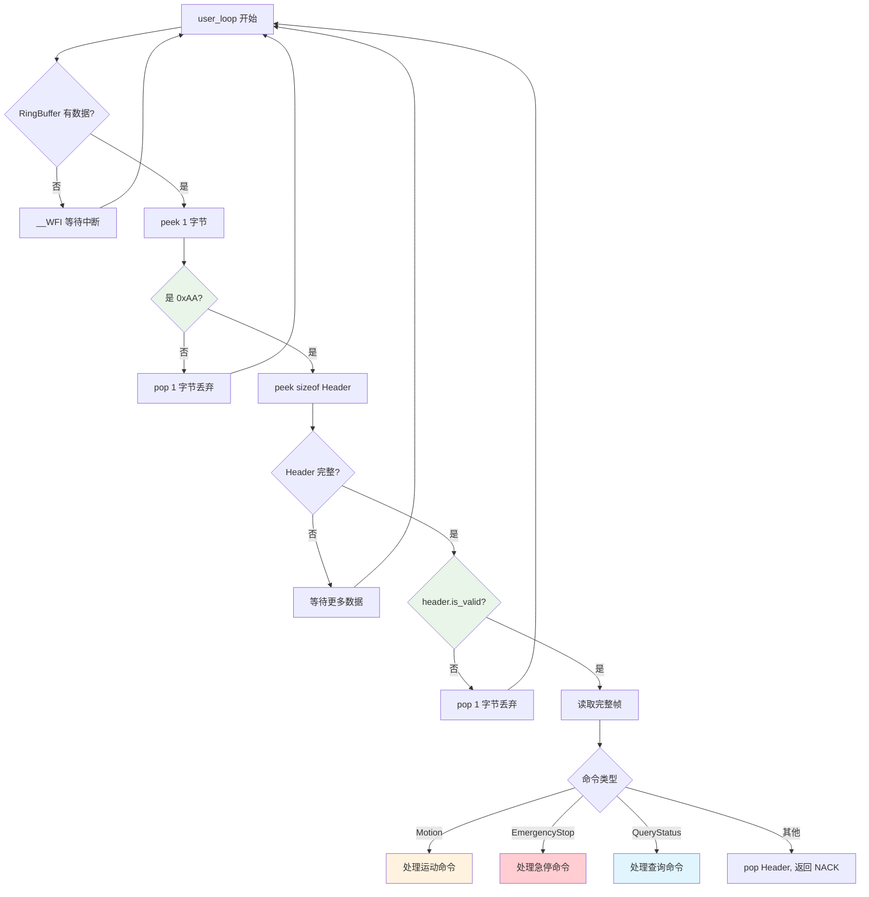

#### 3.2.4 Motion 命令处理流程图

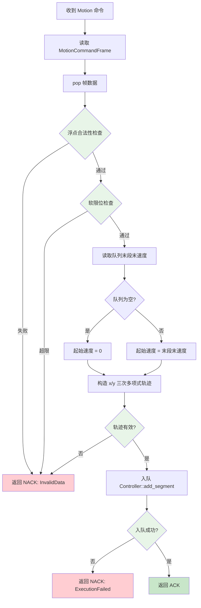

### 3.3 轨迹规划模块

#### 3.3.1 设计目标

在关节空间内生成平滑的轨迹曲线，保证位置连续且端点速度满足指定约束，支持多段轨迹的连续衔接。

#### 3.3.2 实现方式

轨迹规划由 `PolinomialProfile` 类实现，支持 Linear 和 Cubic 两种插值类型。当前工程实际使用 Cubic 模式。构造函数根据起始步数、终止步数、运动时间、起始速度和终止速度计算三次多项式系数（`user/polinomial_profile.hpp:30-73`）。

三次多项式形式为：

$$
q(t) = q_s + a_1 t + a_2 t^2 + a_3 t^3
$$

系数由边界条件 $q(0)=q_s$、$q(T)=q_e$、$\dot q(0)=v_s$、$\dot q(T)=v_e$ 确定。

#### 3.3.3 轨迹生成流程图

```mermaid
flowchart TD
    A[输入参数] --> B[起始步数 q_s]
    A --> C[终止步数 q_e]
    A --> D[运动时间 T]
    A --> E[起始速度 v_s]
    A --> F[终止速度 v_e]

    B --> G{检查 T > 0}
    C --> G
    D --> G
    E --> G
    F --> G

    G -->|否| H[标记无效]
    G -->|是| I[计算系数 a1 = vs]
    I --> J[计算系数 a2]
    J --> K[计算系数 a3]
    K --> L[保存 offset_step = qs]
    L --> M[保存 steps = qe - qs]

    N[current_step 调用] --> O{检查有效性}
    O -->|无效| P[返回起始步数]
    O -->|有效| Q{时间 t > 0?}
    Q -->|否| P
    Q -->|是| R{插值类型}
    R -->|Linear| S[round(a1*t) + offset]
    R -->|Cubic| T[round(a1*t + a2*t^2 + a3*t^3) + offset]

    style G fill:#e8f5e8
    style O fill:#e8f5e8
    style Q fill:#e8f5e8
    style S fill:#e1f5fe
    style T fill:#fff3e0
```

#### 3.3.4 系数计算公式

$$
a_1 = v_s
$$

$$
a_2 = \frac{3(q_e - q_s) - (2v_s + v_e)T}{T^2}
$$

$$
a_3 = \frac{(v_s + v_e)T - 2(q_e - q_s)}{T^3}
$$

### 3.4 运动控制模块

#### 3.4.1 设计目标

管理运动段队列，在定时器中断中按时间推进轨迹，调度两个电机同步执行步进脉冲输出。

#### 3.4.2 实现方式

`Controller<Capacity>` 模板类管理 `SpscQueue<Segment, 128>` 运动段队列。每个 Segment 包含持续时间和两轴轨迹（`user/motor.hpp:123-131`）。主循环调用 `add_segment()` 入队，TIM1 中断调用 `update_handler()` 出队执行（`user/motor.hpp:138-188`）。

`Motor` 类负责角度到步数的转换和 GPIO 脉冲输出。`request_step()` 每次最多推进一步，通过 PUL/DIR/ENA 引脚驱动步进电机（`user/motor.hpp:49-78`）。

#### 3.4.3 Controller::update_handler 流程图

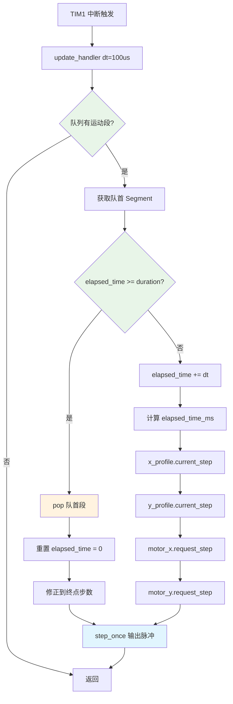

#### 3.4.4 Motor::request_step 流程图

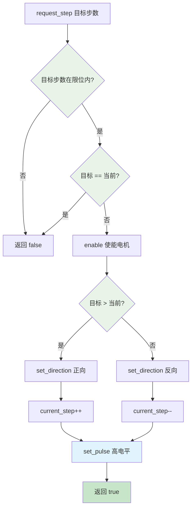

#### 3.4.5 step_once 脉冲宽度保证

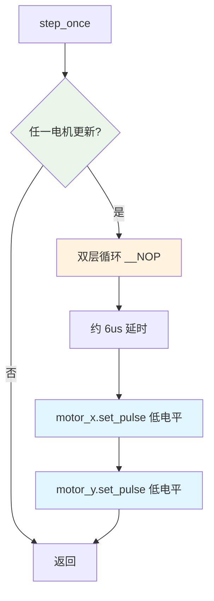

### 3.5 定时器调度模块

#### 3.5.1 设计目标

提供精确的 100 μs 周期中断，作为运动控制的时间基准，确保轨迹插值和脉冲输出的时序精度。

#### 3.5.2 实现方式

TIM1 配置为 72 MHz / 72 分频 / 100 周期 = 100 μs 中断周期（`Core/Src/tim.c:43-46`）。中断优先级设为 0（最高），确保脉冲输出不受其他中断干扰（`Core/Src/tim.c:83-84`）。中断处理函数通过 HAL 回调机制转发到 `controller.update_handler(100)`（`user/user_main.cpp:81-88`）。

#### 3.5.3 定时器配置参数

| 参数 | 值 | 说明 |
|---|---|---|
| 时钟源 | 72 MHz | HSE + PLL ×9 |
| 预分频器 | 72 - 1 = 71 | 计数频率 1 MHz |
| 周期 | 100 - 1 = 99 | 中断周期 100 μs |
| 中断优先级 | 0, 0 | 最高优先级 |

### 3.6 电机驱动模块

#### 3.6.1 设计目标

将关节角度转换为步进电机脉冲序列，通过 GPIO 引脚控制 PUL/DIR/ENA 信号，实现单步精确控制。

#### 3.6.2 实现方式

`Motor` 类封装角度到步数的转换逻辑和 GPIO 操作。转换公式为：

$$
step = round\left( \theta \cdot \frac{N}{2\pi} \right) - offset
$$

其中 $N=3200$ 为每转脉冲数，$offset$ 为上电偏移步数（`user/motor.hpp:80-83`）。

GPIO 引脚分配：

| 信号 | 电机 0 | 电机 1 |
|---|---|---|
| PUL | PA0 | PA1 |
| DIR | PA2 | PA3 |
| ENA | PA4 | PA5 |

---

## 4. 模块间协作流程

### 4.1 系统启动流程

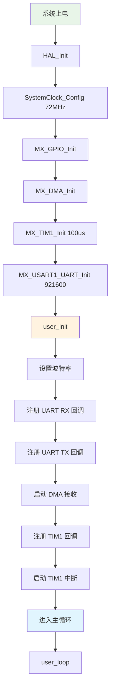

### 4.2 完整运动控制流程

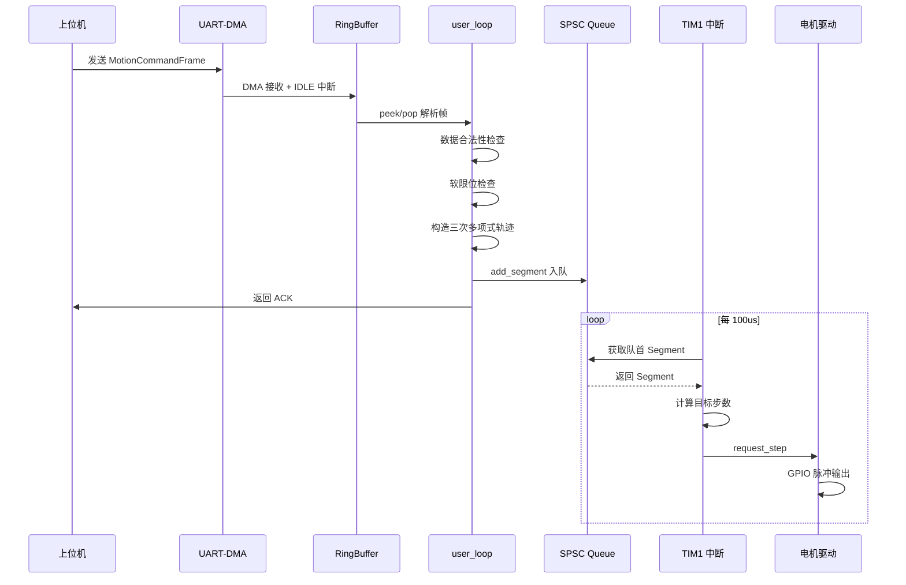

### 4.3 急停处理流程

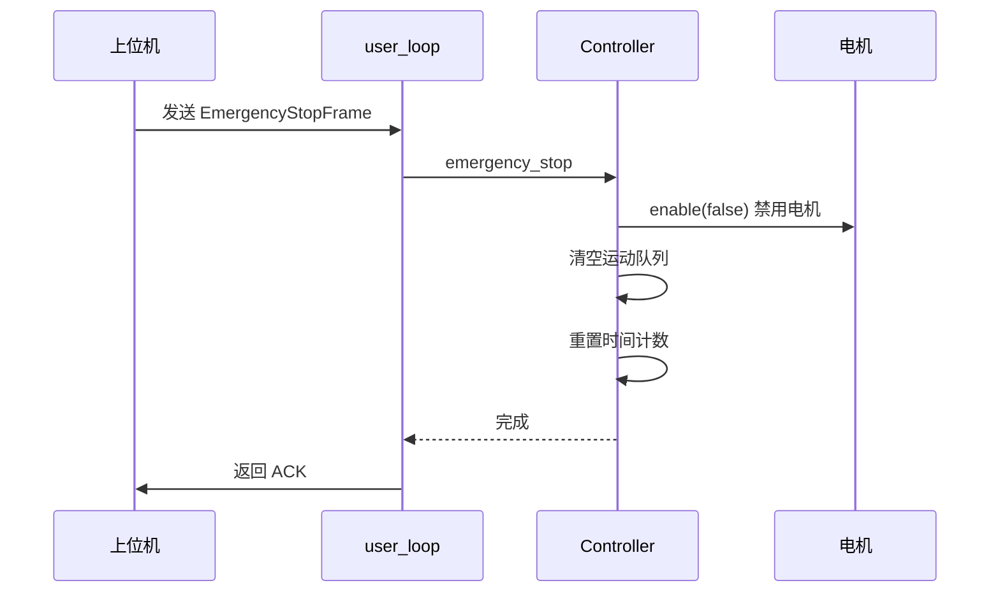

### 4.4 状态查询流程

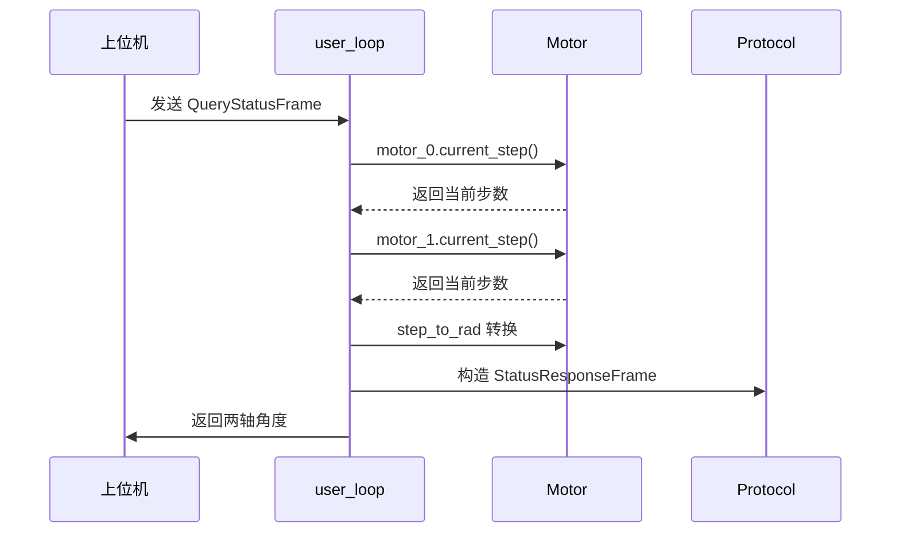

---

## 5. 数据流与并发模型

### 5.1 执行上下文划分

系统存在三个主要执行上下文，各自承担不同职责：

| 执行上下文 | 优先级 | 主要职责 | 共享资源 |
|---|---|---|---|
| 主循环 | 最低 | 协议解析、轨迹构造、入队 | RingBuffer (读), SPSC Queue (写) |
| UART/DMA 中断 | 中 | 数据接收、缓冲切换 | RingBuffer (写), DMA 缓冲区 |
| TIM1 中断 | 最高 | 轨迹执行、脉冲输出 | SPSC Queue (读), Motor 状态 |

### 5.2 无锁并发机制

| 共享资源 | 生产者 | 消费者 | 同步机制 |
|---|---|---|---|
| RingBuffer | UART 中断 | 主循环 | 原子头尾指针，单生产者单消费者 |
| SPSC Queue | 主循环 | TIM1 中断 | 原子头尾指针，容量为 2 的幂 |
| uart_tx_busy | 主循环 | TX 中断 | 原子布尔标志 |
| Motor::current_step_ | TIM1 中断 | 主循环 (读) | 单写者，允许短暂不一致 |

### 5.3 数据流图

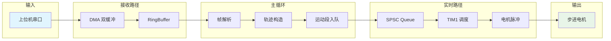

---

## 6. 总结

本文档系统阐述了 SCARA 机械臂下位机控制系统的设计目标、功能模块划分和实现方式。系统采用分层架构，将通信驱动、协议解析、轨迹规划、运动控制和电机驱动划分为独立模块，通过 RingBuffer 和 SPSC Queue 实现模块间的数据传递，通过定时器中断保障实时性。

各模块内部流程和模块间协作关系通过 Mermaid 流程图直观呈现，为系统理解、维护和扩展提供参考。当前系统已实现基本的关节空间运动控制功能，未来可在此基础上扩展运动学求解、闭环控制和更高级的轨迹规划算法。
